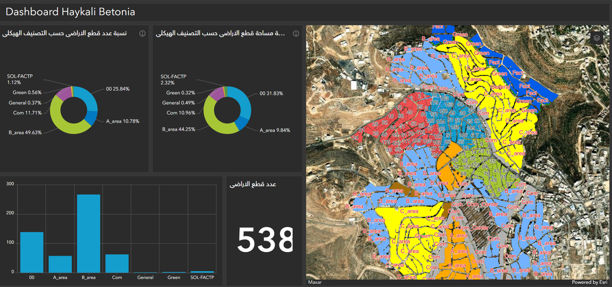

# Geo-Database-of-Betonia
build a geo data base for Betonia city using ArcGIS pro, then create app on ArcGIS online (enterprise)

🗺️ Land Use & Parcels GIS Project
📌 Overview

This project focuses on building a geodatabase for managing land use and parcel information within the city. It is designed to serve as a foundation for spatial data management and to support future web applications that allow citizens and decision-makers to easily access land-related information.

Currently, the project contains three sample blocks from the city as a starting dataset. Over time, it will expand to cover the entire urban area.

🔑 Features

Geodatabase Structure

Parcel layers with land use attributes

Building layers and related data tables

Attribute rules for data quality

Topology rules to ensure spatial integrity

Data Management

Relationships between parcels, owners, and land use classifications

Configured pop-ups for better visualization in GIS platforms

Integration of related tables for detailed information

Planned Web Application

A user-friendly web app for city residents and planners

Access to parcel and land use information through interactive maps

Search and filter functions to quickly find land-related data

Future tools for analysis and reporting

🚀 Roadmap

 Build an initial geodatabase for parcels and land use

 Apply attribute rules and topology roles

 Expand the dataset beyond the first 3 blocks

 Configure advanced pop-ups and related records

 Develop the web application for public access

 Add analysis & reporting features

🌍 Use Cases

Urban Planning – Identify land use patterns and zoning issues

Citizens – Search and view parcel ownership or building details

Government Agencies – Access accurate land data for decision-making

Developers – Evaluate land availability and usage constraints

📸 Screenshots & Links

## 📸 Screenshots
 ArcGis Pro

web map

simple Dashboard

🤝 Contributing

Contributions are welcome!
If you have suggestions for improving the geodatabase structure, attribute rules, or web app features, feel free to open an issue or submit a pull request.
